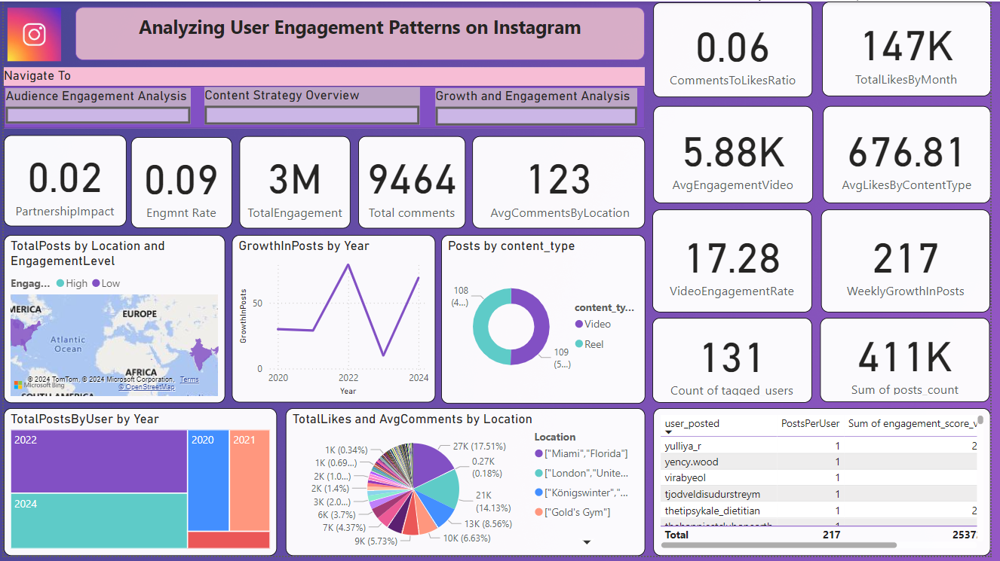

# Analyzing-User-Engagement-Patterns-on-Instagram

A comprehensive project to analyze Instagram account performance using **Power BI** and **Python**. This repository includes:
- A dataset for Instagram metrics
- A Power BI dashboard for interactive analytics
- Exploratory Data Analysis (EDA) using Python for deeper insights

The primary goal of this dashboard is to analyze user engagement on Instagram posts, providing insights that can enhance content strategy, optimize posting schedules, and improve audience interaction based on data-driven findings.

## Table of Contents
- [Project Overview](#project-overview)
- [Features](#features)
- [Installation](#installation)
- [Usage](#usage)
- [Dataset](#dataset)
- [Results](#results)
- [Contributing](#contributing)
- [License](#license)
    

## Project Overview

This project analyzes Instagram performance by leveraging:
1. **Dataset**: Raw data containing engagement metrics, follower trends, and content performance.
2. **Power BI Dashboard**: An interactive dashboard to visualize key insights.
3. **EDA with Python**: Exploratory analysis to uncover trends and relationships in the data.

The goal is to help Instagram users or marketers optimize their strategies with data-driven insights.


## Features
- **EDA using Python**: Detailed analysis of engagement, follower growth, and content performance.
- **Power BI Dashboard**: Interactive visuals for real-time insights.
- **Dataset**: Comprehensive metrics to support analysis.


## Usage

1. Open the `data/instagram_dataset.csv` for an overview of the dataset.
2. Explore the dataset using the `notebooks/eda_instagram.ipynb` notebook.
   - Run the Jupyter notebook to perform EDA and visualize trends.
3. Load the Power BI dashboard (`dashboard/instagram_dashboard.pbix`) to interact with visualizations.

For a quick preview, check the screenshots in the `images/` folder.
 

## Dataset
The dataset includes:
- **Columns**: Likes, comments, shares, follower count, post type, timestamp, etc.
- **Size**: 1000 rows

## Additional Features
Project features and highlights:

- **Sentiment Analysis**: Performed sentiment analysis on Instagram comments using Python to evaluate audience reactions.
- **KPI Metrics**: Added custom metrics like engagement rate, comments-to-likes ratio, and average post performance by type.
- **Content Strategy Insights**: Provided actionable recommendations based on data-driven findings.
- **Time-Based Analysis**: Analyzed trends by day and hour to identify optimal posting times.
- **Navigation-Friendly Dashboard**: Created interactive buttons for seamless navigation within the Power BI dashboard.


### Source
- https://brightdata.com/products/datasets/instagram/ 

## Preview


## Results

- **EDA**: Identified trends like peak engagement times, top-performing content types, and audience demographics.
- **Dashboard**: Visualized trends and patterns in a user-friendly manner.

## Future Scope
- Incorporate predictive analytics to forecast engagement trends.
Automate data updates with Power BI's scheduled refresh feature.
- Expand the dataset for improved accuracy and reliability.
- Include competitor analysis for benchmarking Instagram performance.
- Challenges and Learnings
  
**Challenges**:
  
- Handling inconsistent location data (e.g., variations in city names and formats).
- Managing missing or null values in comments data.
  
**Learnings**:
  
- Gained insights into Instagram's engagement algorithms.
- Learned effective dashboard storytelling techniques.

## Contributers 🙌
Thanks to these amazing people for contributing to this project:

- [SHIVANI PATIL](https://github.com/shivani309) Main contributor
- [UZMA PATIL](https://github.com/Uzzx1110)
- [SEJAL HANMANTE](https://github.com/SEJALHANMANTE)

## Installation

### Clone the Repository
```bash
git clone https://github.com/SEJALHANMANTE/Analyzing-User-Engagement-Patterns-on-Instagram
cd Analyzing-User-Engagement-Patterns-on-Instagram


